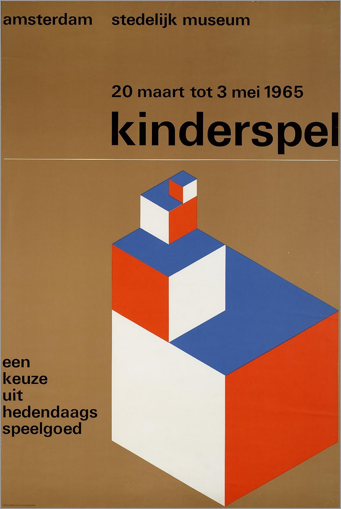

<!-- Every README should start with an H1 -->
# Math Quiz
<!-- A one-sentence description of the project or assignment -->
A CSS practice to recreate a Swiss poster.

<!-- It is good practice to add an about or summary -->
## About
This project is called Swiss Poster Design.
The project's goal was to recreate a Swiss Poster using CSS.
You can try it [here](https://cuinjune-swiss-poster-design.glitch.me).

<!-- It is essential to describe how to set up your project -->
## Setup

<!-- Any knowledge or tools you will need beforehand -->
### Prerequisites

To try out Swiss Poster Design locally on your browser, you need the followings: 
1. Python
2. A Web Browser

### Installation

1. Open the Terminal
2. Run `git clone https://github.com/cuinjune/swiss-poster-design.git` to clone this repository
3. Run `cd math-quiz`
4. Run `python -m SimpleHTTPServer` to start your local server
5. Open the Web Browser, visit http://localhost:8000/ to see the result.

<!-- Write instructions on how to start working on your project -->
### Develop

To develop this document, you can follow the steps provided below:
1. Create a fork of this project on Github
2. Ping the author of this repo via Github Issues to see if they are looking for contributions on the specific feature you're looking to add
3. Open the file in VS Code and make updates 
4. Add and commit those changes in your forked Github repo
5. Make a pull request specifying what additions and changes were made
6. Have a nice chat and communicate with me about those changes. 
7. Celebrate the contribution! 

<!-- Notes about the deployment -->
### Deployment

This project is hosted on Github. Github renders markdown files.

## Built with

* [VS Code](https://code.visualstudio.com/)
* [Github](https://github.com)

## Author

* [Zack Lee](https://www.cuinjune.com/about): an MPS Candidate at [NYU ITP](https://itp.nyu.edu)
