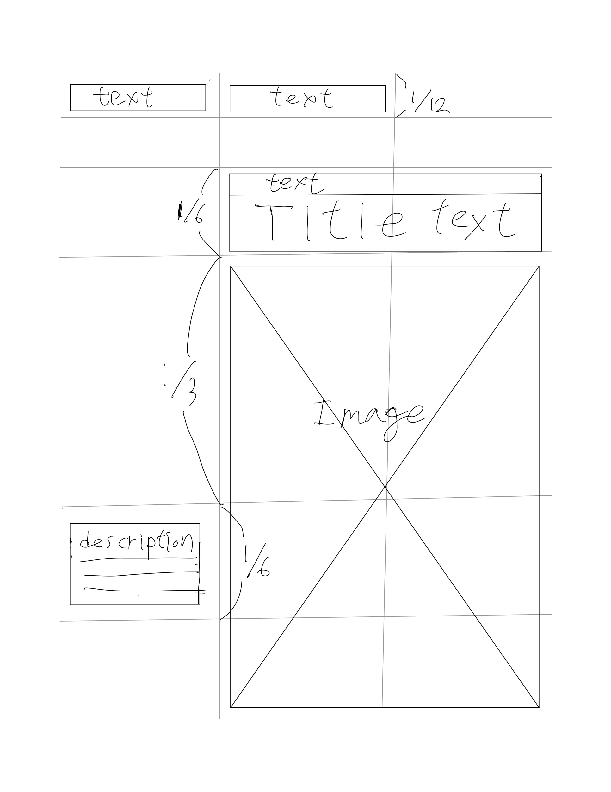
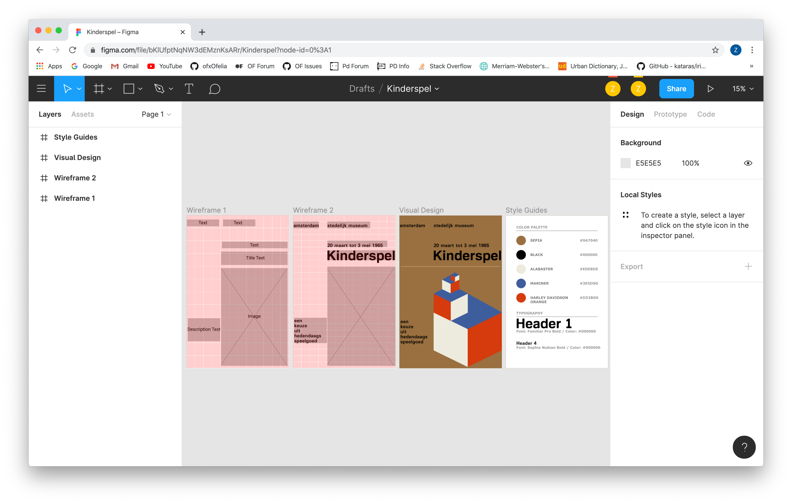
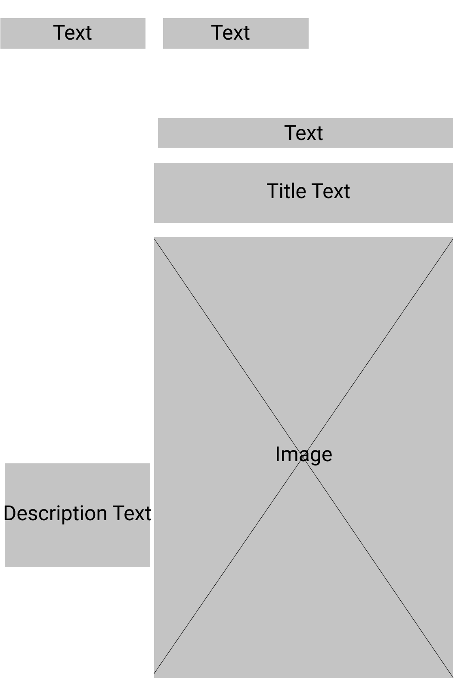
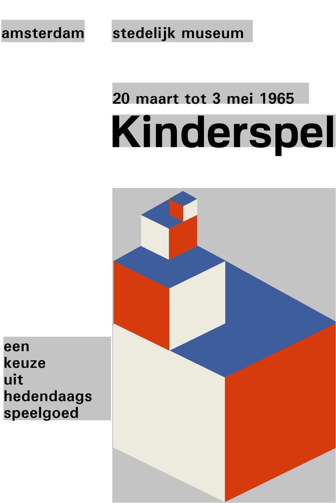
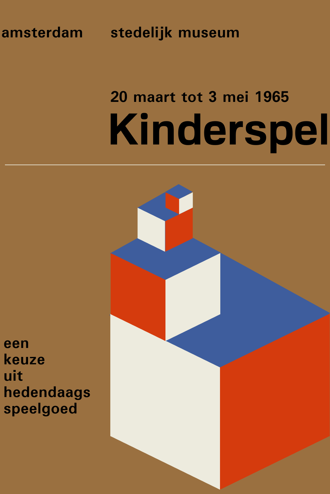
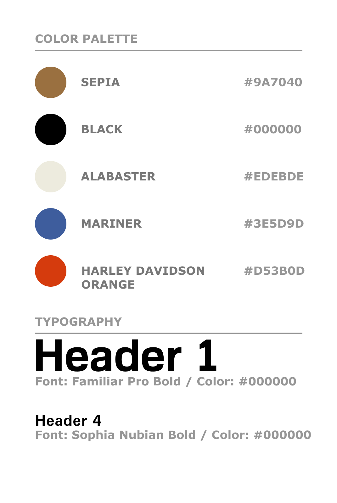
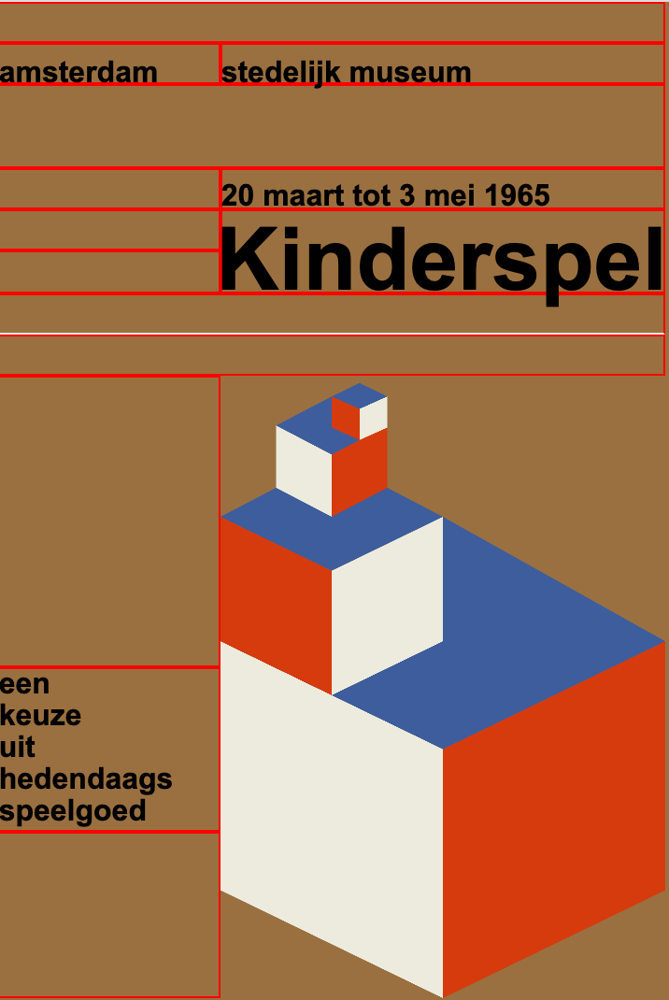

# Swiss Poster Design
This is the week 2 assignment for the ITP class Dynamic Web Development.

[Live Demo on Glitch](https://cuinjune-swiss-poster-design.glitch.me)


## Inspiration
I chose the following poster since I find it simple, balanced, and has an organized grid system.


## Design

I started with drawing a rough sketch to determine how the contents should be placed.


And then I used [Figma](https://www.figma.com/file/bKlUfptNqNW3dEMznKsARr/Kinderspel?node-id=0%3A1) to create wireframe, visual design, and style guide. 


### Wire Frame1


### Wire Frame2


### Visual Design


### Style Guides


## Building the Website
I structured the HTML page with flex boxes that are essentially made of rows and columns and based on the wireframe sketch, I added width and height styles to each box in the CSS section.

The page's dimensions are 1071 x 1600 in pixels just like the original poster image and I divided the page into 12 x 24 grids.
To make texts align properly with the grid, I had to modify the `line-height` CSS property.



For the cubes image section, I used p5js to draw it and then embedded into the HTML.

[Cubes p5js sketch](https://editor.p5js.org/cuinjune/sketches/Bfw5MZRO)

And finally, I made the page responsive to the browser resizing by changing the flex-direction.

```
@media screen and (max-width: calc(1071px / 12 * 9)) {
    .row2 {
        flex-direction: column;
    }
}
```


## Author

* [Zack Lee](https://www.cuinjune.com/about): MPS Candidate at [NYU ITP](https://itp.nyu.edu)
